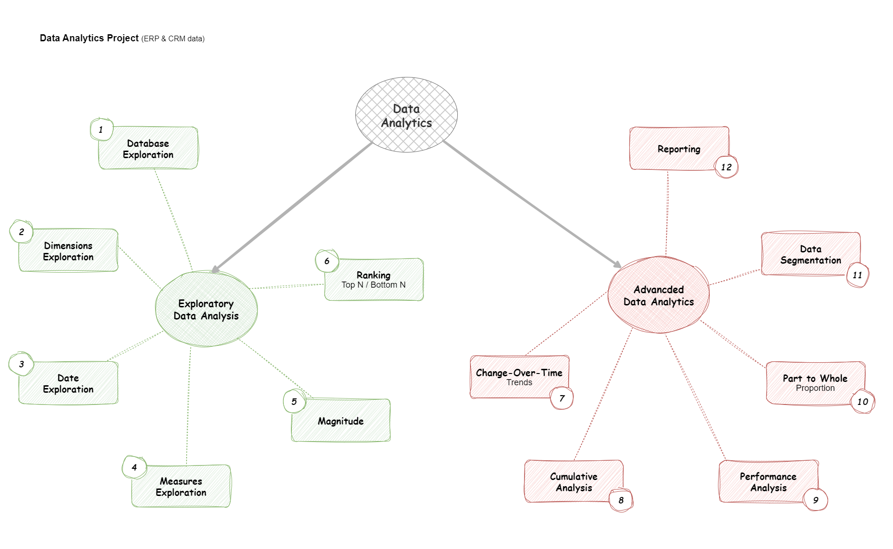

# Data Analytics Project

Welcome to the **Data Analytics Project** repository! ☄️

This project shows SQL scripts I used for data Exploration, Analysis and Reporting. It is based on the outcome of a **[Data Warehouse Project](https://github.com/wisdomadewumi/Data-Warehouse-Project)** I built sometime ago; I use the gold layer for this pahse. Designed as a portfolio project, it highlights industry best practices and orderly workflow in data and analytics.

---
## 📖 Project Overview

This project involves:

1. **Data Exploration**: Understanding the structure and content of the database to identify key dimensions and measures.
2. **Analytics**: Analyzing customer demographics, product categories, and other dimensions for segmentation. Also, calculating key business metrics like total sales, average price, and total customers.
3. **Reporting**: Generating summary reports of key metrics for business insights.

---
## ☄️ Project Requirements

### 📊 BI: Analytics & Reporting (Data Analysis)

#### 🥅 Objective
Develop SQL-based analytics to deliver detailed insights into:

- **Customer Behaviour**
- **Product Performance**
- **Sales Trends**

These insights empower stakeholders with key business metrics, enabling strategic decision-making

---
## 🗃️ Repository Structure
```
data-analytics-project/
│
├── datasets/                           # Raw datasets used for the project (ERP and CRM data)
│
├── docs/                               # Project documentation and architecture details
│   ├── data_analytics_steps.drawio     # Draw.io file shows the project's 12 steps
│
├── scripts/                            # SQL scripts for data exploration and analytics
│   ├── 01_analytics/                   # Scripts for exploring and analyzing transformed data
│   ├── 02_reporting/                   # Scripts for reporting analyzed data for customers and products
│
├── README.md                           # Project overview and instructions
├── LICENSE                             # License information for the repository
```

---
## 12-Step Agenda

The steps to explore and analyze the data are outlined here:


---
## 🧩 Skills Showcased

1. **Database Exploration:** Querying metadata using INFORMATION_SCHEMA.TABLES and INFORMATION_SCHEMA.COLUMNS to understand database structure.
2. **Data Retrieval:** Using SELECT statements with filtering, grouping, and ordering to extract meaningful data.
3. **Joins:** Performing LEFT JOIN operations to combine data from multiple tables (e.g., fact_sales, dim_customers, and dim_products).
4. **Aggregations:** Using aggregate functions like SUM, COUNT, AVG, MIN, and MAX to calculate metrics.
5. **Window Functions:** Applying RANK and ROW_NUMBER for ranking and partitioning data.
6. **Subqueries and Common Table Expressions (CTEs):** Using subqueries and WITH clauses for complex queries and intermediate calculations.
7. **Conditional Filtering:** Using WHERE and HAVING clauses to filter data based on specific conditions.
8. **Union Operations:** Combining results from multiple queries using UNION ALL.
9. **Sorting and Limiting Results:** Using ORDER BY and TOP to sort and limit query results.

---
## 🪪 License

This project is licensed under the MIT License. You are free to use, modify and share this project with proper attribution.

## 👨🏽 About Me

Hello friendly stranger! I go by the name **Divine-Wisdom O. Adewumi** and I'm a Biomedical Laboratory Scientist turned Data Analyst on account of my penchant for seeking and finding patterns in data all around us. Insights from data in healthcare, business, education, music and geopolitics tend to pique my interest the most.

We can connect on LinkedIn or you could check my portfolio website:

[](https://www.linkedin.com/in/divine-wisdom-adewumi)
[](https://wisdomadewumi.github.io)

----
## 📝 Shout Out

Thanks to **Data with Baraa**'s YouTube Channel, I was able to not only complete this but understand the excellent intricacies involved in building a data pipeline. He is one of the best (if not the best) teachers on YouTube as regards Data Engineering Data Science and Data Analytics.
Kindly check him out here:

[](https://www.youtube.com/@datawithbaraa)
